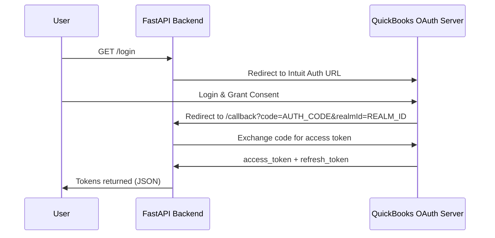
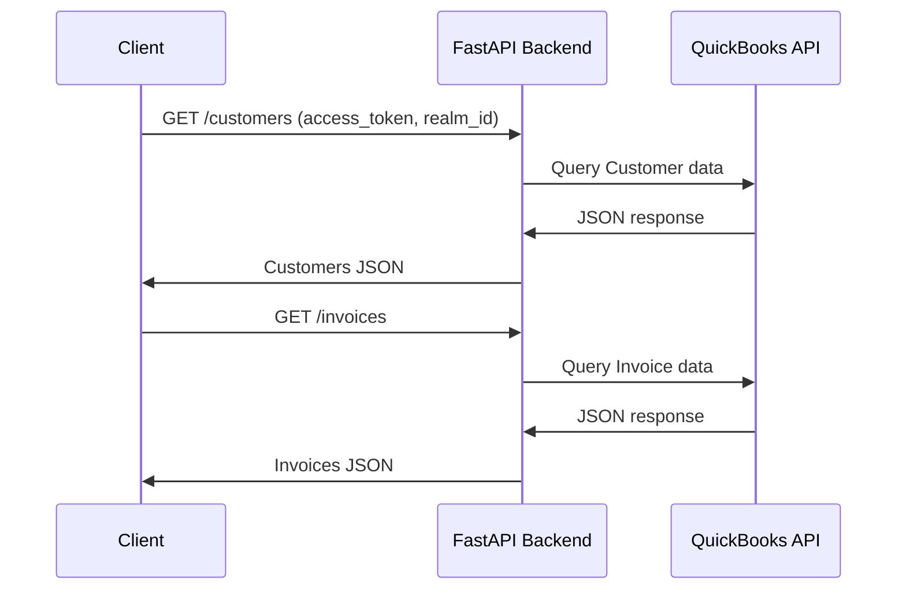

# quickbooks-crm 📈

A super minimal Python FastAPI REST API that integrates with QuickBooks using `OAuth 2.0` to read core accounting data from a sandbox company.

I built this just for fun and to demonstrate real-world API integration, authentication flows, and backend proficiency.

## OAuth 2.0 Authentication Flow



## API Data Fetch Flow (Customers / Invoices / Payments / Accounts)



## API Endpoints

### `GET /login`

Redirects the user to Intuit’s OAuth authorization page.

### `GET /callback`
Handles the OAuth redirect from Intuit and exchanges authorization code for OAuth tokens.

**Returns:**  
```json
{
  "token_info": {
    "token_type": "bearer",
    "x_refresh_token_expires_in": "...",
    "refresh_token": "...",
    "access_token": "...",
    "expires_in": 3600
  },
  "realm_id": "..."
}
```

_Endpoints below require these **two** query parameters that are retrieved upon logging in and authenticating as shown above:_
* ``access_token``
* ``realm_id``

### `GET /customers`
Returns all customers in the QuickBooks company.

**Returns:**  
```json
{
  "Customer": [
    {
      "sparse": true,
      "Id": "1",
      "DisplayName": "Amy's Bird Sanctuary",
      "PrimaryEmailAddr": {
        "Address": "Birds@Intuit.com"
      }
    },
    {
      "sparse": true,
      "Id": "2",
      "DisplayName": "Bill's Windsurf Shop",
      "PrimaryEmailAddr": {
        "Address": "Surf@Intuit.com"
      }
    }
  ]
}
```

### `GET /invoices`
Returns bills sent to customers, including totals and outstanding balances.

**Returns:**  
```json
{
  "Invoice": [
    {
      "sparse": true,
      "Id": "130",
      "DocNumber": "1037",
      "TxnDate": "2025-12-04",
      "LinkedTxn": [],
      "Line": [],
      "CustomerRef": {
        "value": "24",
        "name": "Sonnenschein Family Store"
      },
      "BillAddr": {
        "Id": "95"
      },
      "TotalAmt": 362.07,
      "Balance": 362.07
    },
    {
      "sparse": true,
      "Id": "129",
      "DocNumber": "1036",
      "TxnDate": "2025-12-04",
      "LinkedTxn": [],
      "Line": [],
      "CustomerRef": {
        "value": "8",
        "name": "0969 Ocean View Road"
      },
      "BillAddr": {
        "Id": "94"
      },
      "TotalAmt": 477.5,
      "Balance": 477.5
    }
  ]
}
```

### `GET /payments`
Returns all payments received from customers.

**Returns:**  
```json
{
  "Payment": [
    {
      "CustomerRef": {
        "value": "8",
        "name": "0969 Ocean View Road"
      },
      "TotalAmt": 387,
      "sparse": true,
      "Id": "128",
      "SyncToken": "0",
      "TxnDate": "2025-12-04",
      "Line": []
    },
    {
      "CustomerRef": {
        "value": "3",
        "name": "Cool Cars"
      },
      "TotalAmt": 1675.52,
      "sparse": true,
      "Id": "120",
      "SyncToken": "0",
      "TxnDate": "2025-12-04",
      "Line": []
    }
  ]
}
```

### `GET /accounts`
Returns internal financial accounts such as bank accounts, revenue, and expenses.

**Returns:**  
```json
{
  "Account": [
    {
      "Name": "Accounting",
      "AccountType": "Expense",
      "AccountSubType": "LegalProfessionalFees",
      "CurrentBalance": 0,
      "sparse": true,
      "Id": "69"
    },
    {
      "Name": "Accounts Payable (A/P)",
      "AccountType": "Accounts Payable",
      "AccountSubType": "AccountsPayable",
      "CurrentBalance": -1602.67,
      "CurrentBalanceWithSubAccounts": 0,
      "sparse": true,
      "Id": "33"
    },
    {
      "Name": "Accounts Receivable (A/R)",
      "AccountType": "Accounts Receivable",
      "AccountSubType": "AccountsReceivable",
      "CurrentBalance": 5281.52,
      "sparse": true,
      "Id": "84"
    }
  ]
}
```

## High Level Setup
* Create a QuickBooks Developer account
* Create a QBO app
* Create a sandbox company
* Add credentials to `config.py`
* Run FastAPI server
* Visit `/login` to authenticate

## Notes
* Tokens are returned directly for simplicity (not production-safe)
* No pagination or filtering implemented yet
* Aimed for quick learning (pun intended hahah)
